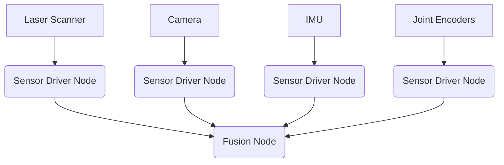

# Complete System Architecture: Module 1 - ROS 2 Nervous System

## Overview

This document details the complete system architecture for the ROS 2 Nervous System module, demonstrating how all individual components work together to form a cohesive humanoid robotics system.

## High-Level System Architecture

The ROS 2 Nervous System module implements a distributed architecture where different nodes handle specific aspects of the robot's functionality:

```
┌─────────────────────────────────────────────────────────────────────────────────┐
│                            HUMANOID ROBOT SYSTEM                                │
├─────────────────────────────────────────────────────────────────────────────────┤
│  ┌─────────────────┐  ┌─────────────────┐  ┌─────────────────┐                 │
│  │   Perception    │  │   Reasoning     │  │   Actuation     │                 │
│  │    Layer        │  │    Layer        │  │    Layer        │                 │
│  │                 │  │                 │  │                 │                 │
│  │ - Sensor        │  │ - State         │  │ - Motion        │                 │
│  │   Drivers       │  │   Machines      │  │   Control       │                 │
│  │ - Data Fusion   │  │ - Decision      │  │ - Trajectory    │                 │
│  │                 │  │   Making        │  │   Planning      │                 │
│  └─────────────────┘  └─────────────────┘  └─────────────────┘                 │
└─────────────────────────────────────────────────────────────────────────────────┘
```

## Component Architecture

### 1. Perception Layer
The perception layer handles all sensor data processing:

- **Sensor Drivers**: Nodes that interface directly with hardware sensors (cameras, lidars, IMUs, joint encoders)
- **Sensor Processing**: Nodes that convert raw sensor data into useful information
- **Data Fusion**: Nodes that combine information from multiple sensors



### 2. Reasoning Layer
The reasoning layer handles decision-making and high-level control:

- **Behavior Trees**: Structured decision-making patterns
- **State Machines**: Manages robot's internal states (idle, walking, interacting, etc.)
- **Planning Nodes**: Path planning, task planning
- **Python Agents**: High-level decision making and AI integration

### 3. Actuation Layer
The actuation layer handles executing commands:

- **Controller Nodes**: Interface with hardware controllers
- **Trajectory Generators**: Generate smooth motion paths
- **Joint Command Processors**: Convert high-level commands to joint-level commands

## Core Communication Architecture

### ROS 2 Topic Architecture
The system uses a publish-subscribe communication model for most data streams:

```
┌─────────────────┐         ┌─────────────────┐         ┌─────────────────┐
│   Sensor Node   │ publish │   Processing    │ publish │   Consumer      │
│                 │--------▶│     Node        │--------▶│     Node        │
│ - Hardware      │         │ - Process       │         │ - Use processed │
│   Interface     │         │   sensor data   │         │   data          │
└─────────────────┘         └─────────────────┘         └─────────────────┘
```

**Critical Topics:**
- `/joint_states` - Current positions of all joints
- `/scan` - Laser scan data for obstacle detection
- `/imu/data` - Inertial measurement data
- `/camera/image_raw` - Camera image stream
- `/cmd_vel` - Velocity commands for navigation
- `/tf` and `/tf_static` - Coordinate transforms

### ROS 2 Service Architecture
Services provide request-response communication for specific tasks:

```
┌─────────────────┐         ┌─────────────────┐
│   Service       │ request │   Service       │
│   Client Node   │--------▶│    Server       │
│                 │◀────────│     Node        │
│ - Request       │ response│ - Process       │
│   action        │         │   request       │
└─────────────────┘         └─────────────────┘
```

**Critical Services:**
- `/enable_motors` - Enable/disable motor power
- `/set_parameters` - Dynamically configure parameters
- `/get_robot_info` - Retrieve robot status information

### ROS 2 Action Architecture
Actions provide goal-oriented communication with feedback for long-running tasks:

```
┌─────────────────┐         ┌─────────────────┐
│   Action        │ goal    │   Action        │
│   Client Node   │--------▶│    Server       │
│                 │         │     Node        │
│ - Send goal     │◀────────│ - Execute task  │
│   with feedback │ result  │ - Provide       │
│   and result    │         │   feedback      │
└─────────────────┘         └─────────────────┘
```

**Critical Actions:**
- `/follow_joint_trajectory` - Execute complex joint movements
- `/move_base` - Navigate to a specific location
- `/manipulation` - Execute manipulation tasks

## Data Flow Architecture

### Real-Time Control Loop
The system maintains a real-time control loop for responsive behavior:

```
┌─────────────────┐    ┌─────────────────┐    ┌─────────────────┐
│   Sensing       │    │   Processing    │    │   Actuation     │
│   (~20Hz)       │───▶│   (~20Hz)       │───▶│   (~20Hz)       │
│                 │    │                 │    │                 │
│ - Joint states  │    │ - State         │    │ - Send motor    │
│ - IMU data      │    │   estimation    │    │   commands      │
│ - Laser scan    │    │ - Control       │    │ - Update        │
│ - Camera        │    │   computation   │    │   displays      │
└─────────────────┘    └─────────────────┘    └─────────────────┘
```

### Event-Driven Processing
For infrequent or bursty events:

```
┌─────────────────┐    ┌─────────────────┐    ┌─────────────────┐
│   Event Source  │    │   Event         │    │   Event         │
│                 │───▶│   Processor     │───▶│   Handler       │
│ - Button press  │    │                 │    │                 │
│ - Goal received │    │ - Queue event   │    │ - Respond to    │
│ - Error state   │    │ - Process when  │    │   event         │
│ - Task complete │    │   convenient    │    │                 │
└─────────────────┘    └─────────────────┘    └─────────────────┘
```

## Node Organization Architecture

### Core Nodes
```
humanoid_controller (main orchestrator)
├── sensor_processor
│   ├── laser_node
│   ├── camera_node
│   └── imu_node
├── behavior_engine
│   ├── state_machine
│   └── decision_maker
└── motion_controller
    ├── trajectory_generator
    └── joint_controller
```

### Python Agents Architecture
```
python_agents
├── navigation_agent
│   ├── path_planner
│   └── obstacle_avoider
├── manipulation_agent
│   ├── grasp_planner
│   └── trajectory_executor
└── interaction_agent
    ├── gesture_recognizer
    └── speech_interpreter
```

## Integration Architecture

### URDF Integration
The URDF model is integrated into the system through several key components:

1. **Robot State Publisher**: Publishes joint transformations to maintain the robot's kinematic tree
2. **Joint State Broadcaster**: Provides real-time joint position information
3. **Controllers**: Map high-level commands to specific joint actuator commands

### Simulation Integration
For simulation environments:

1. **Gazebo Bridge**: Translates between ROS 2 messages and Gazebo physics engine
2. **Sensor Simulation**: Emulates real sensors in a simulated environment
3. **Actuator Simulation**: Emulates real actuators in a simulated environment

## Safety Architecture

### Redundancy
- Multiple sensor inputs for critical functions (e.g., both laser and camera for obstacle detection)
- Backup control modes if primary systems fail
- Timeout mechanisms for long-running operations

### Error Handling
- Graceful degradation when sensors fail
- Emergency stop capabilities
- Health monitoring and reporting

## Performance Architecture

### Real-Time Requirements
- Joint control loop: 100-200 Hz
- Sensor processing: 20-50 Hz
- High-level planning: 1-5 Hz

### Resource Management
- Efficient message passing to minimize latency
- Proper CPU and memory allocation to critical nodes
- Throttling of non-critical computations during heavy loads

## System Validation Architecture

### Unit Testing
Each component should be individually testable with mock dependencies.

### Integration Testing
Components are tested together in increasing scopes of complexity.

### System Testing
Full system validation in both simulated and real environments.

## Extensibility Architecture

### Plugin Architecture
The system is designed to be extensible with new sensors, behaviors, and capabilities through a plugin architecture.

### Configuration Flexibility
Parameters are externalized to allow easy adjustment without code changes.

This architecture provides a solid foundation for developing humanoid robots using ROS 2, with clear separation of concerns and well-defined interfaces between components.